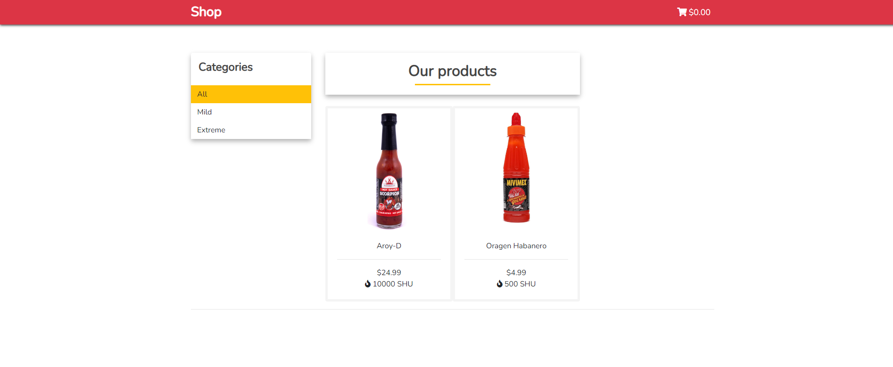
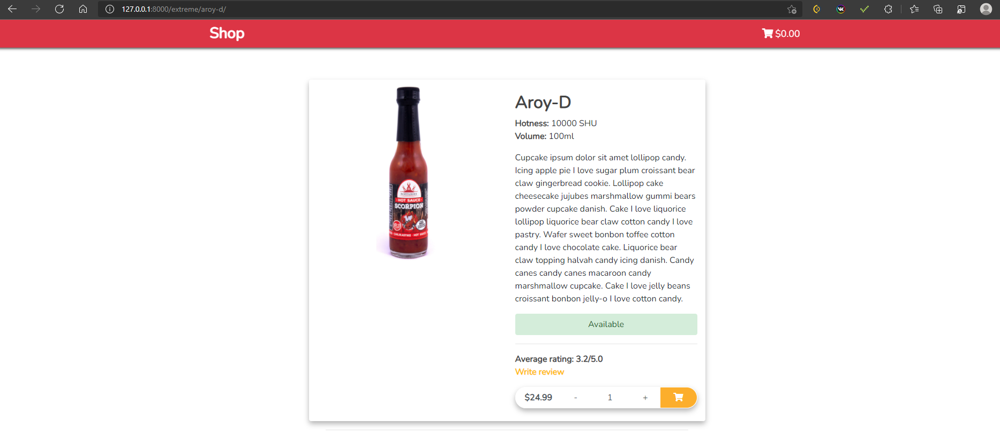
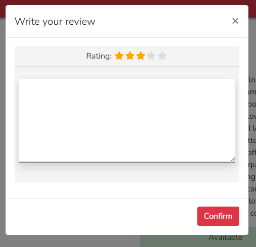
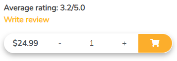
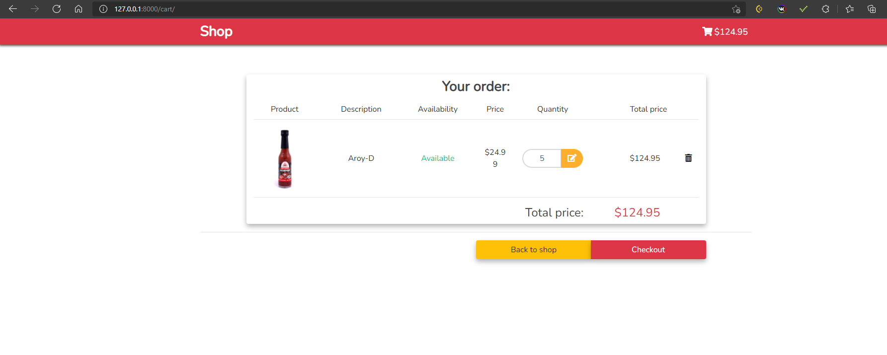
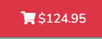
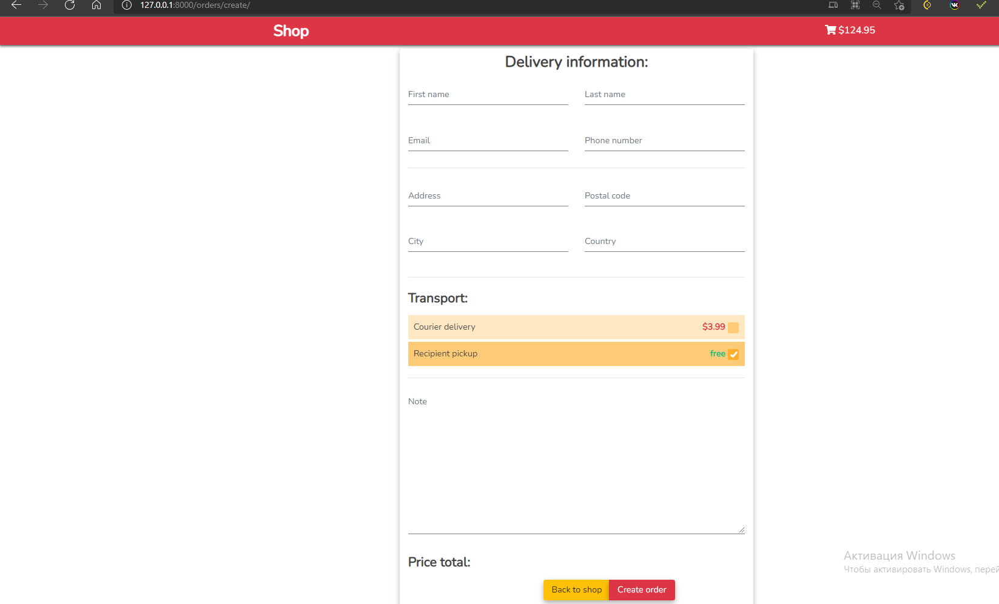

# Интернет магазин на django
(в разработке!)

## 1. Каталог товаров, также можно выбрать категорию
 

## 2. Детализированная страница товара

- Имеется возможность оставить отзыв на товар с системой рейтинга 
  - Также все оценки рейтинга учитываются и показывается средняя оценка товара
  - 

## 3. Корзина и заказ
 - Возможность добавлять удалять товар, также итоговая цена всех товаров в корзине 
 - Также сумма всех товаров корзины добавлена в контекст менеджер, поэтому на всех страницах, отображается ценна товаров в корзине 
 - Страница оформения заказа 